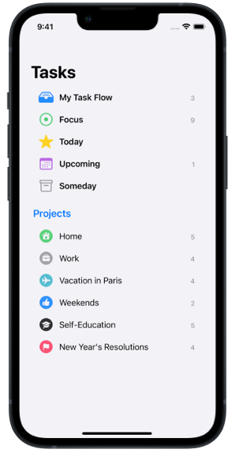

# How to create a UICollectionView List with Compositional Layout and UIDiffableDataSource in Swift

Create lists using a modern compositional layout list configuration for a UICollectionView. In addition, we'll use a diffable datasource to populate our list content. Sample project included.

## Links
- 📕 Reference Article: [How to create a UICollectionView List with Compositional Layout and UIDiffableDataSource in Swift](https://www.vbutko.com/articles/how-to-create-uicollectionview-list-with-compositional-layout/)
- 📕 Blog about Swift and iOS Development www.vbutko.com

## Screenshots

    

